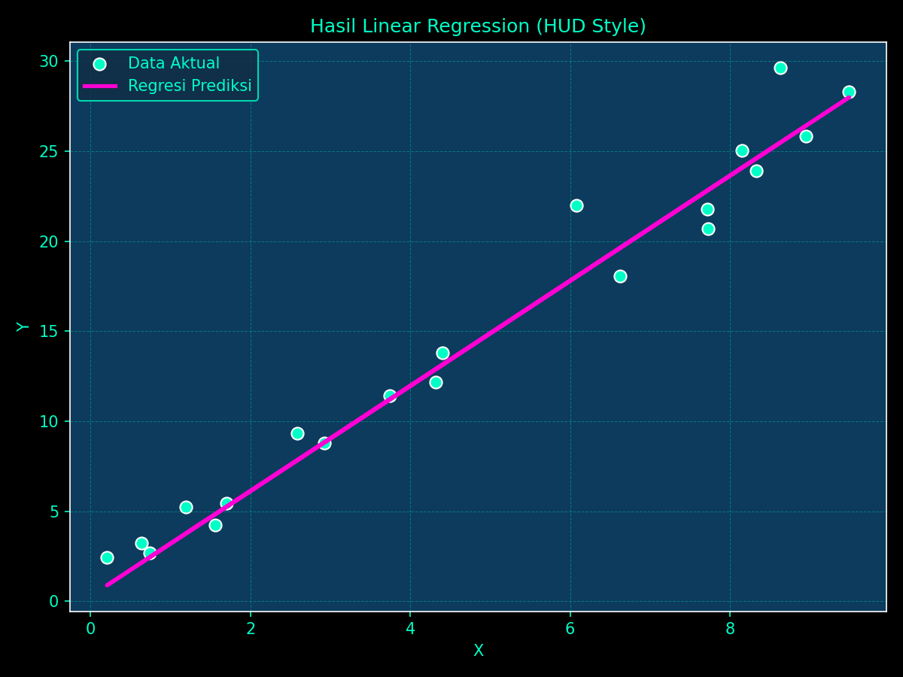

# linear-regression-streamlit-app

Dashboard interaktif menggunakan Streamlit dan Linear Regression (scikit-learn) dengan tampilan futuristik ala HUD (Heads-Up Display). Input nilai numerik, lalu lihat prediksinya secara real-time disertai radar animasi dan grafik bergaya neon.

# Simple Linear Regression Dashboard (HUD Style)

Proyek ini adalah implementasi sederhana dari **Linear Regression** menggunakan `scikit-learn`, kemudian disajikan dalam bentuk **dashboard interaktif** dengan **Streamlit**. Desain visual mengadopsi gaya **futuristic HUD (Heads-Up Display)** lengkap dengan **radar animasi SVG** dan grafik neon.

## 🚀 Fitur

- Membuat dataset sintetik (dummy)
- Melatih model Linear Regression
- Menyimpan model ke file `.pkl`
- Menyediakan UI dashboard interaktif
- Visualisasi prediksi + radar animasi SVG
- Tampilan futuristik neon HUD dengan CSS

## 📁 Struktur Proyek

```
.
├── streamlit_app.py      # Aplikasi dashboard Streamlit (UI interaktif)
├── main.py               # Training model dan menyimpan ke pickle
├── requirements.txt      # Semua dependency Python
├── regression_plot.png   # Hasil visualisasi model
├── .gitignore            # File/folder yang diabaikan Git
└── models/
    └── linear_model.pkl  # File model hasil training
```

## ⚙️ Instalasi & Menjalankan

```bash
# 1. Clone repo ini
git clone https://github.com/username/linear-regression-hud-dashboard.git
cd linear-regression-hud-dashboard

# 2. Install dependency
pip install -r requirements.txt

# 3. Jalankan training untuk membuat model & visualisasi
python main.py

# 4. Jalankan dashboard Streamlit
streamlit run streamlit_app.py
```

## 📊 Contoh Visualisasi
Output dari `main.py` menyimpan plot hasil prediksi regresi linear dengan gaya neon HUD:



## 🧠 Teknologi
- Python
- scikit-learn
- Streamlit
- Pickle
- Matplotlib
- NumPy & Pandas
- HTML/CSS (untuk animasi radar & UI styling)

## 🧪 Fitur Tambahan
- Animasi radar menggunakan `streamlit.components.html` (SVG + CSS)
- Layout modular dengan `st.columns` dan `st.tabs`
- Tema warna: `#0C3B5D` (background), `#00FFC6` (neon accent)
- UI berbasis font futuristik (Orbitron)

## 📌 Lisensi
Proyek ini menggunakan lisensi MIT. Bebas digunakan dan dimodifikasi.

---

Created with 💡 by Ariel Shakaramiro
